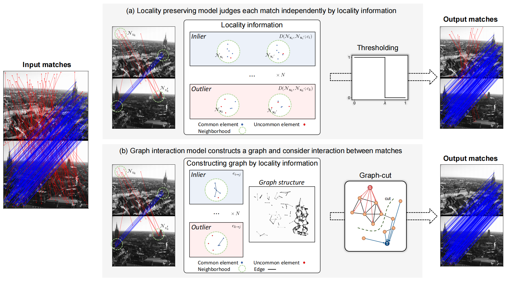

# TIM
Official implementation of the JAS paper: <a herf="https://doi.org/10.1109/jas.2023.123774" target="_blank">Feature Matching via Topology-aware Graph Interaction Model</a>.


## Introduction



## Citation
If you find this work helpful, please consider citing:
```bibtex
@article{lu2024feature,
  title={Feature Matching via Topology-Aware Graph Interaction Model},
  author={Lu, Yifan and Ma, Jiayi and Mei, Xiaoguang and Huang, Jun and Zhang, Xiao-Ping},
  journal={IEEE/CAA Journal of Automatica Sinica},
  volume={11},
  number={1},
  pages={113--130},
  year={2024},
  publisher={IEEE}
}
```
